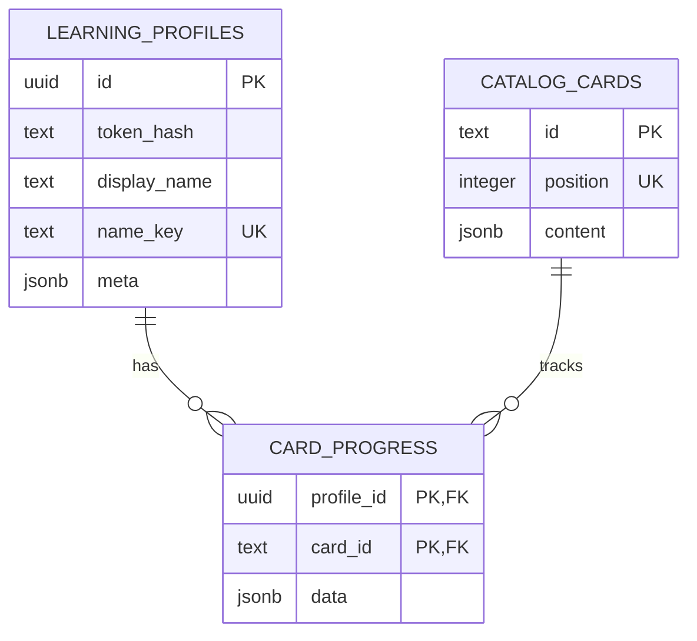
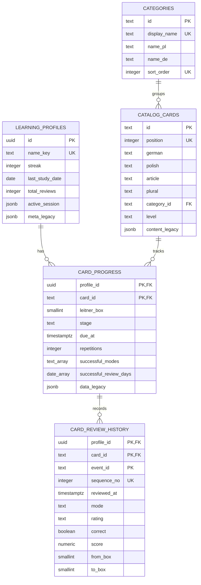

# Normalizacja bazy German Learning

Migracja: `20260727_001_normalize_learning_data`

## Wynik audytu

Audyt produkcji wykonano wyłącznie zapytaniami `SELECT` i `EXPLAIN`. Przed migracją baza zawierała:

| Element | Liczba |
|---|---:|
| Karty | 3038 |
| Profile | 15 |
| Nazwane profile | 2 |
| Rekordy postępu | 71 |
| Zdarzenia historii | 139 |
| Zaliczone tryby ćwiczeń | 59 |
| Dni udanych powtórek | 58 |
| Aktywne sesje | 5 |

Nie znaleziono osieroconych rekordów, duplikatów pozycji ani nazw profili, nieznanych etapów i trybów, niepoprawnych przegródek ani brakujących wymaganych pól kart.

Przed:



Po:



Nazwy `content_legacy`, `meta_legacy` i `data_legacy` na diagramie oznaczają istniejące kolumny `content`, `meta` i `data`, zachowane wyłącznie dla zgodności przejściowej i rollbacku.

## Macierz decyzji

| Obecne pole | Problem | Nowa struktura | Korzyść | Koszt / ryzyko | Decyzja |
|---|---|---|---|---|---|
| `catalog_cards.content` | 15 stabilnych właściwości wymaga ścieżek JSONB | Jawne kolumny karty | Czytelność, typy, proste filtry i eksport | Szerszy wiersz, przejściowy dual-write podczas synchronizacji katalogu | Spłaszczyć |
| `content.category` | Powtarzany napis w 3038 kartach | `categories` + FK | Jedna lista kategorii, polska i niemiecka nazwa, integralność | Jeden prosty JOIN | Normalizować |
| `card_progress.data` — pola SRS | Stabilny schemat potrzebny do due/box/stage | Jawne kolumny SRS | Proste indeksy, raporty i kontrola zakresów | Więcej kolumn, przejściowy dual-write | Spłaszczyć |
| `data.reviewHistory` | Rosnąca tablica utrudnia analizę w czasie | `card_review_history` | Jedno zdarzenie = jeden wiersz, proste statystyki | Dodatkowa tabela i zapis w transakcji | Normalizować |
| `data.successfulModes` | Mały, ograniczony zbiór | `TEXT[]` | Typowana kolumna bez zbędnej tabeli łączącej | Analizy wymagają `unnest` | Spłaszczyć do tablicy |
| `data.successfulReviewDays` | Mała lista dat | `DATE[]` | Walidowane daty, bez tabeli pomocniczej | Analizy wymagają `unnest` | Spłaszczyć do tablicy |
| `learning_profiles.meta` — statystyki | Często prezentowane i raportowane liczniki | Jawne kolumny profilu | Proste agregacje i typy | Przejściowy dual-write | Spłaszczyć |
| `meta.activeSession` | Chwilowy, wersjonowany i zmienny obiekt kolejki | `active_session JSONB` | Zachowuje atomowy snapshot sesji | Brak relacyjnej analizy wnętrza | Pozostawić JSONB |
| Pojedyncze tryby jako relacja M:N | Tylko sześć wartości, mały zbiór | — | Niewielka dodatkowa korzyść | Nadmierna liczba wierszy i JOIN-ów | Nie normalizować |

## Strategia i zgodność

Migracja działa jako `expand → backfill → validate → switch`:

1. dodaje tabele i kolumny bez usuwania starego schematu;
2. kopiuje wartości z JSONB;
3. porównuje liczniki, relacje, sumy kontrolne i rekonstrukcję każdego obiektu;
4. dopiero po zerowej liczbie różnic API czyta relacyjny schemat;
5. API nadal zwraca dotychczasowe obiekty `cards`, `progress` i `meta`;
6. każdy zapis relacyjny i awaryjny JSONB odbywa się w jednej transakcji;
7. odczyt ma fallback pole po polu do JSONB.

Okresowy dual-write jest świadomy i ograniczony do wydania przejściowego. Zapobiega utracie nowych postępów po rollbacku aplikacji. Walidator `npm run db:validate` wykrywa każdą różnicę pomiędzy obiema reprezentacjami.

## Plany wykonania

Przed migracją pobranie katalogu korzystało z indeksu `catalog_cards_position_key` i wykonywało się w około `1.34 ms` dla 3038 kart. Po zmianie API pobiera jawne kolumny tym samym indeksem, a 17 kategorii ładuje osobnym małym zapytaniem i łączy w pamięci. Unika to sortowania całego katalogu po relacyjnym JOIN-ie.

Najważniejsza nowa ścieżka powtórek:

```sql
SELECT card_id, due_at
FROM card_progress
WHERE profile_id = $1 AND due_at <= NOW()
ORDER BY due_at;
```

korzysta bezpośrednio z indeksu `card_progress_due_idx`. W starym schemacie równoważny filtr wymagał rzutowania `data->>'dueAt'` i nie miał indeksu. Przy obecnych 71 rekordach różnica czasu jest pomijalna, ale plan pozostaje stabilny wraz ze wzrostem danych.

## Przykładowa analityka

Karty według kategorii i poziomu:

```sql
SELECT category.name_pl, card.level, COUNT(*) AS cards
FROM catalog_cards card
JOIN categories category ON category.id = card.category_id
GROUP BY category.name_pl, card.level
ORDER BY category.name_pl, card.level;
```

Poznane i opanowane słowa profilu:

```sql
SELECT
  COUNT(*) FILTER (WHERE stage IN ('known', 'mastered')) AS learned,
  COUNT(*) FILTER (WHERE stage = 'mastered') AS mastered
FROM card_progress
WHERE profile_id = $1;
```

Rozkład przegródek:

```sql
SELECT leitner_box, COUNT(*) AS cards
FROM card_progress
WHERE profile_id = $1
GROUP BY leitner_box
ORDER BY leitner_box;
```

Karty oczekujące na powtórkę:

```sql
SELECT card.german, progress.due_at, progress.leitner_box
FROM card_progress progress
JOIN catalog_cards card ON card.id = progress.card_id
WHERE progress.profile_id = $1 AND progress.due_at <= NOW()
ORDER BY progress.due_at;
```

Skuteczność trybów:

```sql
SELECT
  mode,
  COUNT(*) AS attempts,
  ROUND(100.0 * AVG(correct::integer), 1) AS accuracy_percent
FROM card_review_history
WHERE profile_id = $1
GROUP BY mode
ORDER BY attempts DESC;
```

Najczęściej mylone rodzajniki:

```sql
SELECT card.article, card.german, COUNT(*) AS mistakes
FROM card_review_history history
JOIN catalog_cards card ON card.id = history.card_id
WHERE history.profile_id = $1
  AND history.mode = 'choice-article'
  AND NOT history.correct
GROUP BY card.id, card.article, card.german
ORDER BY mistakes DESC, card.german;
```

Najtrudniejsze słowa:

```sql
SELECT card.german, progress.lapses, progress.typed_attempts,
       progress.typed_successes, progress.leitner_box
FROM card_progress progress
JOIN catalog_cards card ON card.id = progress.card_id
WHERE progress.profile_id = $1
ORDER BY progress.lapses DESC,
         progress.typed_successes::numeric / NULLIF(progress.typed_attempts, 0),
         card.german;
```

Postęp profilu w czasie:

```sql
SELECT reviewed_at::date AS day,
       COUNT(*) AS attempts,
       COUNT(*) FILTER (WHERE correct) AS correct
FROM card_review_history
WHERE profile_id = $1
GROUP BY reviewed_at::date
ORDER BY day;
```

## Rollback

Rollback aplikacji nie wymaga cofania danych:

1. wdrożyć poprzedni commit aplikacji;
2. poprzednie API ponownie czyta `content`, `data` i `meta`;
3. te kolumny pozostają aktualizowane w tej samej transakcji co nowy schemat;
4. uruchomić `npm run db:validate`, aby potwierdzić zgodność;
5. nowych tabel i kolumn nie usuwać podczas rollbacku.

Migrację można ponownie uruchomić bez zmiany wyniku. Test `npm run db:migrate:test` wykonuje ją dwa razy na izolowanej kopii produkcyjnych tabel.

## Odroczone sprzątanie

Dopiero w osobnym zadaniu, po okresie obserwacji i kolejnym eksporcie, można rozważyć usunięcie:

- `catalog_cards.content`;
- `card_progress.data`;
- `learning_profiles.meta`;
- fallbacków w `api/learning.js`;
- przejściowego dual-write.

To przyszłe usunięcie musi mieć własną migrację, walidację i plan rollbacku. Nie jest częścią bieżącego wdrożenia.
